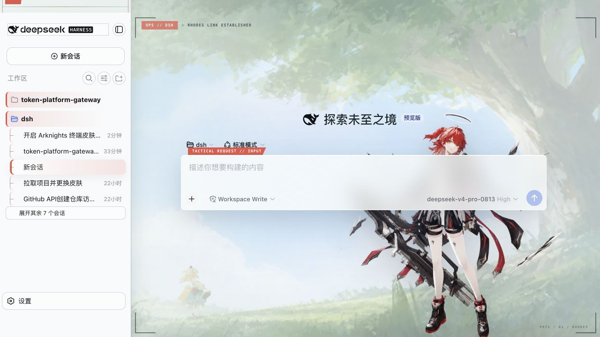
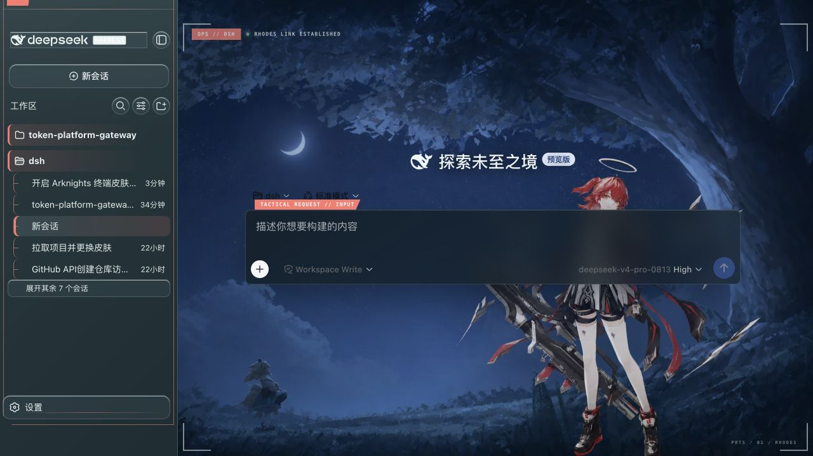

# 罗德岛终端 · Rhodes Operations Terminal

> DeepSeek Harness Web GUI 的非商业明日方舟同人主题皮肤。





## 视觉与动效

- 初始页：固定白天森林与同构夜景，夜景包含月亮和星空。
- 工作区：固定明暗罗德岛移动作战甲板，不再从素材目录随机轮换。
- 人物：仅使用重新生成的红发干员透明图层；白天为背景/人物双层视差，夜间为低幅人物单层视差。
- 表面：输入框、composer、菜单、listbox、对话框和消息叶节点使用磨砂玻璃；大面积工作流容器不模糊人物。
- 动效：对菜单、对话框、标签页、工作区树及状态切换注入短促的语义动画；退场副本不可交互并在结束后移除。
- 降级：尊重 `prefers-reduced-motion` 与 `prefers-reduced-transparency`，在触摸屏、窄屏、页面失焦或不可见时停止视差。
- 清理：停用/卸载时移除样式、人物、HUD、侧栏装饰、观察器、事件监听和退场副本，不影响其他皮肤。

设置对话框出现时，皮肤会追加“罗德岛终端外观”，可在“跟随系统 / 白天 / 夜晚”之间即时切换。

## 构建与验证

```sh
npm run build
npm run check
```

构建脚本只使用 Node.js 标准库，将 WebP 素材和 CSS 内嵌进 `lib/client.js`，运行时不需要联网。

## 安装

### 从 GitHub 安装

```sh
git clone https://github.com/xhunzt-wq/dsh-arknights-terminal.git
cd dsh-arknights-terminal
dsh plugin --profile web add "$PWD"
```

刷新 DSH Web 页面后启用皮肤。DSH 的插件安装需要 `pnpm` 可在 `PATH` 中使用；若尚未安装，请先安装 pnpm。

### 本地开发目录安装

```sh
dsh plugin --profile web add /Users/xhunz/dsh/dsh-arknights
```

本机 profile 已通过 `link:` 引用该目录，因此重新构建后刷新浏览器即可看到更新。若命令提示找不到 pnpm，可先把 pnpm 所在目录加入 `PATH`，再执行安装。

启用本皮肤时应明确关闭其他皮肤：

```yml
- id: ui-skin-maid-atelier
  name: '@dsh-external/dsh-client-ui-skin-maid-atelier'
  disabled: true

- id: ui-skin-arknights-terminal
  name: '@dsh-external/dsh-client-ui-skin-arknights-terminal'
  disabled: false
```

## 素材与公开范围

- `assets/arknights-hero-forest-v2.webp`：白天初始页。
- `assets/arknights-hero-night-v3.webp`：同构夜晚初始页。
- `assets/arknights-workspace-deck-light-v3.webp`：白天工作区。
- `assets/arknights-workspace-deck-dark-v3.webp`：夜晚工作区。
- `assets/arknights-red-operator-v3.webp`：单一红发干员透明动态层。
- 本仓库仅提交运行所需的最终 WebP 图层与预览图；本地开发用的原始人物素材、抠图中间文件和旧版素材均被 `.gitignore` 排除，不会进入公开仓库。
- 请勿将本项目视作对《明日方舟》角色、商标或官方资源的授权。

设计行为参考了 `deepseek-harness-angelina-themes` 与 `dsh-motion` 的公开实现思路，但本项目的视觉素材、CSS 和运行时代码均在本目录独立实现。

## 开发

```sh
npm run build
npm run check
```

构建完成后刷新 DSH 页面即可查看变化。提交前请确认没有启用其他会注入全局样式的皮肤。

## 许可与声明

本项目以 [CC BY-NC-SA 4.0](LICENSE) 发布，仅限非商业用途；详情见 [NOTICE](NOTICE)。

这是非官方同人项目，与鹰角网络、悠星网络无隶属或背书关系。角色及相关商标归其各自权利人所有。
